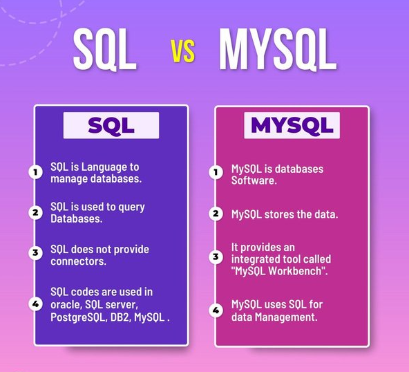
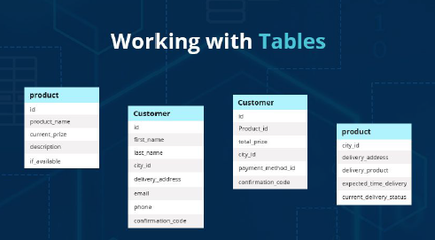
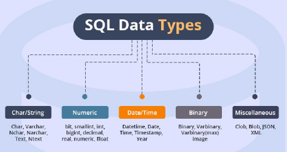
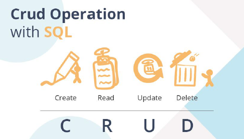

# Programming Notes

A collection of notes and resources on learning Python & SQL, including code snippets, tutorials, and best practices. Ideal for beginners and enthusiasts to enhance their programming skills.

### Getting Started

Frankly speaking, I'm new to the programming world, coming from a completely different niche. But here I am, with one goal: making it easier for new learners!

My goal is to become a **Data Architect**, and Python and SQL play significant roles in this field.

In my case, I'm dividing these two tools into different categories Data Manipulation (python) and Data Management (SQL).

|Data Manipulation|Data Management|
|:---------------:|:-------------:|
|[Python](#python)|[DB](#db)|
|[Visualization Techniques](#vt)|[RDBMS](#rdbms)|
||[SQL](#SQL)| 
### <a id=python>PYTHON</a>

In this context, the specific programming language doesn't matter much; the essence is the same— **PRACTICE**.

### 1.0 Familiarity with Functions, Reserved Keywords & Symbols

Familiarize yourself with functions, reserved keywords, and symbols to enhance your understanding of any programming code. In class, there is often a chapter-by-chapter syllabus, but different people have different learning methods.

For me, learning chapter by chapter sometimes makes me feel stuck, especially during programming tests. But, learning the common functions, keywords and symbols, does escalate my learning process.

Here are some common functions, keywords, and symbols:

#### Functions:
1. `print()`: Outputs a message to the console.
2. `input()`: Takes user input from the console.
3. `len()`: Returns the length of an object (e.g., string, list).
4. `range()`: Generates a sequence of numbers.
5. `type()`: Returns the type of an object.
6. `int()`: Converts a value to an integer.
7. `float()`: Converts a value to a floating-point number.
8. `str()`: Converts a value to a string.
9. `list()`: Creates a list.
10. `tuple()`: Creates a tuple.
11. `dict()`: Creates a dictionary.
12. `set()`: Creates a set.
13. `abs()`: Returns the absolute value of a number.
14. `sum()`: Returns the sum of elements in an iterable.
15. `max()`: Returns the maximum value in an iterable.
16. `min()`: Returns the minimum value in an iterable.
17. `sorted()`: Returns a sorted list of the specified iterable object.
18. `enumerate()`: Returns an enumerate object.
19. `zip()`: Returns an iterator that aggregates elements from multiple iterables.
20. `map()`: Applies a function to all items in an input list.

#### Reserved Keywords:
1. `False`: Represents the false value of the Boolean type.
2. `None`: Represents the absence of a value.
3. `True`: Represents the true value of the Boolean type.
4. `and`: A logical operator for boolean AND.
5. `as`: Used to create an alias while importing a module.
6. `assert`: Used for debugging purposes, tests if a condition is true.
7. `break`: Terminates the nearest enclosing loop.
8. `class`: Used to define a new class.
9. `continue`: Skips the rest of the code inside a loop for the current iteration only.
10. `def`: Used to define a new function.
11. `del`: Deletes objects.
12. `elif`: Used in conditional statements, same as else if.
13. `else`: Used in conditional statements.
14. `except`: Used with exceptions, what to do when an exception occurs.
15. `finally`: Used with exceptions, a block of code that will be executed no matter if there is an exception or not.
16. `for`: Used to create a for loop.
17. `from`: Used to import specific parts of a module.
18. `global`: Declares a global variable.
19. `if`: Used to make a conditional statement.
20. `import`: Used to import a module.
21. `in`: Used to check if a value is present in a list, tuple, etc.
22. `is`: Used to test if two variables refer to the same object.
23. `lambda`: Used to create an anonymous function.
24. `nonlocal`: Declares a non-local variable.
25. `not`: A logical operator for boolean NOT.
26. `or`: A logical operator for boolean OR.
27. `pass`: A null statement, a statement that will do nothing.
28. `raise`: Raises an exception.
29. `return`: Exits a function and returns a value.
30. `try`: Used to make a try...except statement.
31. `while`: Used to create a while loop.
32. `with`: Used to simplify exception handling.
33. `yield`: Ends a function and returns a generator.

#### Symbols:
1. `+`: Addition operator.
2. `-`: Subtraction operator/negation operator.
3. `*`: Multiplication operator.
4. `/`: Division operator.
5. `%`: Modulus operator.
6. `**`: Exponentiation operator.
7. `//`: Floor division operator.
8. `=`: Assignment operator.
9. `==`: Equality comparison operator.
10. `!=`: Not equal comparison operator.
11. `<`: Less than comparison operator.
12. `>`: Greater than comparison operator.
13. `<=`: Less than or equal to comparison operator.
14. `>=`: Greater than or equal to comparison operator.
15. `+=`: Increment assignment operator.
16. `-=`: Decrement assignment operator.
17. `*=`: Multiplication assignment operator.
18. `/=`: Division assignment operator.
19. `//=`: Floor division assignment operator.
20. `%=`: Modulus assignment operator.
21. `**=`: Exponentiation assignment operator.
22. `&`: Bitwise AND operator.
23. `|`: Bitwise OR operator.
24. `^`: Bitwise XOR operator.
25. `~`: Bitwise NOT operator.
26. `<<`: Bitwise left shift operator.
27. `>>`: Bitwise right shift operator.
28. `and`: Logical AND operator.
29. `or`: Logical OR operator.
30. `not`: Logical NOT operator.
31. `is`: Identity operator.
32. `in`: Membership operator.
33. `not in`: Negated membership operator.
34. `:`: Colon used in defining blocks and dictionaries.
35. `,`: Comma used to separate items in lists, tuples, and function arguments.
36. `.`: Dot used to access methods and attributes of objects.
37. `()`: Parentheses used in function calls and to define tuples.
38. `[]`: Square brackets used to define lists and to index/slice sequences.
39. `{}`: Curly braces used to define dictionaries and sets.
40. `#`: Hash symbol used to indicate comments.
41. `"""`: Triple quotes used for multi-line strings.

This list covers a broad range of functions, reserved keywords, and symbols that you'll encounter while programming in Python. There you go, happy learning, for practices you can visit any AI website for more on the definition, and test it at [one compiler](https://onecompiler.com/python) website to test the code.

##  8 Elegant Alternatives to Traditionals Plots

**1 Size-encoded heatmaps**

Color in heatmaps shows trends, but size clarifies exact values. Bigger size means bigger value (positive or negative).

**2 Waterfall Charts**

Line/bar charts hide small changes. Waterfall charts show how values rise and fall perfectly for visualizing small, incremental changes.

**3 Bump Chart**

Bar charts overwhelm with many ranks. Bump charts shine for visualizing category ranking changes over time.

**4 Raincloud Plots**

Box plots & histograms can be misleading. Raincloud plots combine 3 views (stats, overview, distribution) for clarity.

**5 Hexbin Plots**

Many data points? Ditch scatter plots for hexbins! These colorful hexagons show data density, making trends clearer.

**6 Density Plots**

Another choice is a density plot, which illustrates the distribution of points in a two-dimensional space.

**7 Bubble Charts**

Bar charts? Overwhelmed with categories?  Try bubble plots!  Imagine scatter plots with categories on one axis and size showing a separate value.

**8 Dot Plots**

Alternatively, dot plots work better for visualizing change over time.

--------------------------------------------------------------------------------------------------------------------------

##  Db - Database

**What is database?**

Data is a collection of facts related to any object. For example: - Your name, number, birthday, phone number, email address, etc. is a collection of facts about you.

Therefore, a database is a systematic collection of small units of information (data). For example: - An organized list of all the students of a school along with their data (Name, PhoneNumber, Birthday, etc.) is referred to as a database.

##  RDBMS - Relational Database Management Systems

**What is an RDBMS (Relational Database Management System)?**
RDBMS Stands for Relational DataBase Management System and is a collection of tools that allow users to organize, manipulate, and visualize databases. RDMBS follows somes tandards that allow for the fastest response from a database and make it easier for humans to interact with a database. Think of an RDBMS as a tool that allows you to play with your data and generate insights or value from the database.

## <a id=SQL>SQL</a> - Structure Query Language

# Introduction to SQL
Discover a treasure trove of tools for data enthusiasts. Dive into databases, SQL, and essential data management techniques.

- SQL stands for Structured Query Language. As the name suggests, it is a structured language via which you can query the database for performing various tasks such as Storing, Manipulating, and retrieving data from a database.
- SQL is the standard language when it comes to communicating with powerful relational databases such as Oracle, Sybase, Microsoft SQL Server, Access, Ingres, etc. Anything related to data in relational databases such as creating tables, limiting access to data, sorting, filtering, grouping, etc. is achieved using SQL.

**SQL v. MySQL: Difference Between Both**

- Most beginners usually get confused between the two terms - SQL and MySQL, and sometimes use the two interchangeably. However, there is a clear and vast difference between the two.
- As defined earlier, SQL is a language that allows one to communicate with the database. MySQL on the other hand is an RDBMS in which you can type SQL commands to interact withthe database.
- SQL is the language/protocol that is used by relational database management systems to allow users to manipulate data in the database.
- MySQL is a database management system that provides users with an interface to connect with databases. MySQL provides users with the ability to create various databases, tables,stored procedures, functions in their database servers. SQL is the language that is used to perform powerful operations on the database.

**What Can SQL do?**
SQL is one of the  powerful programming language that allows you to communicate with the database. Almost all companies use databases to store and retrieve data in some form or the other. Using SQL, you create Databases, and inside a database, you create various TABLES in which you can add all your data. Using SQL, you can:
1. Create / Delete Databases
2. Create / Delete Table(s) in a database
3. `SELECT` particular data from table(s)
4. `INSERT` data into table(s)
5. `UPDATE` data in table(s)
6. `DELETE` data from table(s)
7. Create `Views` in the database
8. Execute various aggregate functions

**How to get started with SQL?**
- To get started with writing SQL on your computer, you would need to install a Database Management Server. The RDBMS would then give you all the necessary tools to interact with your database.
- There are various RDBMS that you can use, and it doesn't matter (much) what system you choose as long as it's working for you. Some of the most common RDBMS are:
  1. MySQL
  2. Oracle
  3. Microsoft SQL Server
  4. PostgreSQL
  5. Heidi SQL

Just install any of the RDBMS that you like from their official website and you should be able to create a database server by simply following their instructions. Once you have a database server ready, you can get access to a Query Editor where you can type all your SQL queries.

**Working with Tables**

To work with SQL, you need to understand that data is organized into tables. One database would contain all the data for a single application (in most cases). A single database would have multiple tables that store values.

For example:- If you have a restaurant management application or implemented E-Delivery solution for smooth operations, you would have a database that contains tables such as:
  1. Customers
  2. Orders
  3. Menu Items
  4. Receipts
  5. ComBox

Here visual example, for a clear picture.

- etc. Each table would contain a specific type of data and various tables could have different types of relations. Using SQL relations, we can combine values from different tables to fetch the data that we require. (More on relations in a later section).
- To create a table, we would require two things. Firstly, we would need all the fields that we want to store in a table. Secondly, we want to define the type of data that would enter into a table.
- Let's take the restaurant management application's Customers table as an example. We want to store some information about
each of our customers such as their name, Phone Number, and Postal Code. Now that we are done with the first step, we need to define the data types of these values.
The name of a customer would be of character data type because we need to store alphabetical characters. Similarly, the phone number would be characters again because we would need to store country code, and special characters such as '+', '()', etc. The postal code would be of type integer because we need to store numbers. Here is how the table would look like:

|Name|Phone|Postal Code|
|:--:|:---:|:---------:|
|varchar(50)|varchar(15)|integer|

To identify each customer uniquely, we add an ID to them so that we can use this ID to connect data from various tables. So, the final table structure could look something like this.

|ID|Name|Phone|Postal Code|
|:-:|:--:|:---:|:---------:|
|INTEGER|VARCHAR(50)|VARCHAR(15)|INTEGER|

To create this table, we would use the CREATE SQL Command followed by the fields as follows:

`CREATE TABLE customers(`
 
`ID INT NOT NULL,`
 
`name varchar(50),`
 
`phone varchar(15),`
 
`postalCode INT`
 
`);`

 - To delete this table, we would use the `DROP` command as follows:

`DROP TABLE customers;`

**SQL Data Type for Server**
To create tables for manipulating data effectively, we need to work with the correct data type. Let's say we want to work with dates, it would be easier to create a column for holding DATE type values instead of storing them as a string and writing logic to manipulate the values.

Every RDBMS is different and each RDBMS might have a different data type for working with certain values. The following sections of this SQL Cheat Sheet contain the various types of MySQL data types.

**String Data Types**
|Data Type| Description |
|:-------:|:------------|
|CHAR(size)| A fixed-length string that can contain numbers, letters, and special characters. The string length is from 0 - 255.|
|VARCHAR(size)| Variable-length string similar to CHAR(), but with a length from 0 to 65535.
|TEXT(size)| Holds a string of a maximum of 65,536 bytes.|
|TINY TEXT| Holds a string of a maximum of 255 characters.|
|MEDIUM TEXT| Holds a string with a maximum length of 16,777,215 characters.|
|LONG TEXT| Holds a string with a maximum length of 4,294,967,295 characters.|
|BINARY(size)| Similar to CHAR() but stores binary byte strings.|
|VARBINARY(size)| Similar to VARCHAR() but for binary byte strings.|
|BLOB(size)|For holding blobs of up to 65,536 bytes.|
|TINYBLOB|Used for BLOBs (Binary Large Objects). Has a max length of 255 bytes.|
|MEDIUMBLOB| Holds blobs of up to 16,777,215 bytes.|
|LONGBLOB| Holds blobs of size up to 4,294,967,295 bytes.|
|ENUM(val1,val2,…)| A string object that can have only one value is chosen from a list of possible values of up to 65535 values in an ENUM| list. If the value inserted is not in the list, a blank value will be inserted.|
|SET(val1,val2,…)| A string object that can have 0 or more values, chosen from a list of possible values. You can list up to 64 values in a SET list.|

**Numeric Data Types**
|Data Type| Description |
|:-------:|:------------|
|BIT(size)| A bit-value type. The size parameter can hold a value from 1 to 64. The default value for size is 1.|
|INT(size)| A medium integer with a signed range of -2147483648 to 2147483647, and an unsigned range from 0 to 4294967295.|
|TINYINT(size)| A very small integer. The signed range is from -128 to 127. The unsigned range is from 0 to 255.|
|SMALLINT(size)| A small integer. The signed range is from -32768 to 32767. The unsigned range is from 0 to 65535.|
|MEDIUMINT(size)| A medium integer. The signed range is from -8388608 to 8388607. The unsigned range is from 0 to 16777215.|
|BIGINT(size)| A large integer. The signed range is from -9223372036854775808 to 9223372036854775807. The unsigned range is from 0 to 18446744073709551615.|
|BOOL/BOOLEAN| Zero values are considered as FALSE and non-zero values are considered as TRUE.|
|FLOAT(p)| A floating-point value. If the precision parameter(p) is between 0 to 24, the data type is set to FLOAT(), and if it's from 25 to 53, the data type is set to DOUBLE(). This makes the storage of values more efficient.|
|DOUBLE(size,d)| A floating-point number value where the total digits are set by the size parameter, and the number of digits after the decimal point is set by the d parameter.|
|DEC(size,d)/ DECIMAL(size,d)| An exact fixed-point number with the total number of digits set by the size parameters, and the total number of digits after the decimal point set by the d parameter. For size, the maximum number is 65 and the default is 10, while for d, the maximum number is 30 and the default being 10.|

*Note: All the numeric data types may have an extra option: UNSIGNED or ZEROFILL. If you add the UNSIGNED/ZEROFILL option, MySQL disallows negative values for the column.*

**Date/Time Data Types**
|Data Type| Description |
|:-------:|:------------|
|DATE| A simple date in YYYY-MM–DD format, supporting a range from ‘1000-01-01’ to ‘9999-12-31’.|
|TIME(fsp)| A time in hh:mm:ss format, with a supported range from ‘-838:59:59’ to ‘838:59:59’|
|DATETIME(fsp)| A date and time combination in YYYY-MM-DD hh:mm:ss format. The supported range is from '1000-01-01 00:00:00' to '9999-12-31 23:59:59'|
|TIMESTAMP(fsp)|A Unix Timestamp, which is a value relative to the number of seconds since the Unix epoch (‘1970-01-01 00:00:00’ UTC). This has a supported range from ‘1970-01-01 00:00:01’ UTC to ‘2038-01-09 03:14:07’ UTC.|
|YEAR| A year in four-digit format with the range as - 1901 to 2155****|

**CRUD Operations with SQL
Now that we have our table(s) ready, let's see how we can store and retrieve data from the tables in our database. In the following sections of this SQL Basics Cheat Sheet, we would look at the most basic SQL operations.

CRUD is an acronym that stands for Create, Read, Update, and Delete. These are the most fundamental operations that one can perform on any database. For creating any application,these 4 types of operations are crucial. They are:-
  1. INSERT (Create)
  2. SELECT (Read)
  3. UPDATE (Update)
  4. DELETE (Delete)

**INSERT**
To insert data into any table, we use the INSERT INTO statement. The general syntax for insert is:

`INSERT INTO table_name(column1,column2,...)`
 
    `VALUES (val1,val2,...);`

To insert data into our customer's table, we would use the following statement:

`INSERT INTO customers(ID,name,phone,postalCode)`
 
    `VALUES(1,'Alice','+123456789',123456);`

**SELECT**
To read data from a table, we would use the Select statement where we define the columns that we want to fetch. The general syntax is:

`SELECT column1,column2,.. FROM table_name;`

If we wanted to select the name and phone number of a customer from our table, we would use:

`SELECT name, phone FROM customers;`

Also, to read all the columns from our table, we can replace the column names with * as follows:

`SELECT*FROM customers;`

**UPDATE**
To update specific column(s) of specific row(s), we make use of the Update statement. The general syntax for an update statement is:

`UPDATE table_name
 
  `SET column1=value1,column2=value2,...`
 
  `WHERE conditions...;`

For example, if we wanted to update the phone number of a customer that has an ID of 2, we would write our query as:

`UPDATE customers`
 
  `SET phone='+2223334445'`
 
  `WHERE ID=2;`

We can update multiple columns by adding them to the SET statement and we can target multiple rows by adding them to the WHERE statement.

**DELETE**
If we wanted to remove some rows from a table, we would use the delete statement. The general syntax is:

`DELETE FROM table_name`
 
  `WHERE condition...;`

Let's say we want to remove all the customers who live in a particular area. So, we simply delete those rows that have a specific area code:

`DELETE FROM customers`
 
  `WHERE postalCode=223344;`

**LIST OF USEFUL SQL KEYWORDS**

|Keyword|Description|
|:-----:|:----------|
|ADD|Add a new column to an existing table. Eg: ALTER TABLE customers ADD email_address VARCHAR(255);|
|ALTER TABLE|Adds, deletes, or edits columns/constraints in a table. Eg: ALTER TABLE customers DROP COLUMN email_address;|
|ALTER COLUMN|Changes the data type of a table’s column. Eg: ALTER TABLE customers ALTER COLUMN phone varchar(50)|
|AS|Renames a table or column with an alias value that only exists for the duration of the query. Eg: SELECT name AS customer_name, phone, postalCode FROM customers;|
|ASC|Used with ORDER BY to return the data in ascending order.|
|CHECK|Adds a constraint that limits the value which can be added to a column. Eg: CREATE TABLE Users(firstName varchar(255),age INT, CHECK(age>10));|
|CREATE DATABASE|Creates a new database. Eg: CREATE DATABASE my website;|
|CREATE TABLE|Creates a new table. Eg: CREATE TABLE users (id int,firsr_name varchar(255), surname varchar(255), address varchar(255), contact_number int);|
|DEFAULT|Set the default value for a column. Eg: CREATE TABLE products(ID int, name varchar(255) DEFAULT 'Username', from date DEFAULT GETDATE());|
|DELETE|Delete values from a table. DELETE FROM users WHERE user_id= 674;|
|DESC|Used with ORDER BY to return the data in descending order.|
|DROP COLUMN|Deletes a column from a table. ALTER TABLE users DROP COLUMN first_name;|
|DROP DATABASE|Deletes a complete database along with all the tables and data inside. Eg: DROP DATABASE my website;|
|DROP DEFAULT|Removes a default value for a column. Eg: ALTER TABLE products ALTER COLUMN name DROP DEFAULT;|
|DROP TABLE|Delete a table from a database. Eg: DROP TABLE customers;|
|FROM|Specifies which table to select or delete data from. Eg: SELECT * FROM customers;|
|IN|Used with a WHERE clause as a shorthand for multiple OR conditions. Eg: SELECT * FROM users WHERE country IN('USA', 'United Kingdom','Russia');|
|IS NULL|Tests for empty (NULL) values. Eg: SELECT * FROM users WHERE phone IS NULL;|
|IS NOT NULL|Opposite of IS NULL. Tests for values that are not null.|
|LIKE|Returns true if the operand value matches a pattern. SELECT * FROM users WHERE first_name LIKE '%son';|
|ORDER BY|Used to sort the resultant data in ascending (default) or descending order.|
|SELECT DISTINCT|Same as SELECT, except duplicate values are excluded. Eg: SELECT DISTINCT postalCode from customers;|
|TOP|Used alongside SELECT to return a set number of records from a table. Eg: SELECT TOP 5 * FROM customers;|
|VALUES|Used alongside the INSERT INTO keyword to add new values to a table. Eg: INSERT INTO cars (name, model, year) VALUES ('Ford', 'Fiesta', 2010);|
|WHERE|Filters result only includes data that meets the given condition. SELECT * FROM orders WHERE quantity > 1;|

Created by [Lokman](https://lokmanTech.github.io)

Reference: 
- [What is SQL by AWS](https://aws.amazon.com/what-is/sql/#:~:text=Structured%20query%20language%20(SQL)%20is,relationships%20between%20the%20data%20values.)
- [SQL v MySQL by Vishal Goyal, 2023](https://differencebetween04.quora.com/What-is-the-difference-between-SQL-MYSQL)
- [Alternatives to Tradtional Plots](https://blog.dailydoseofds.com/p/8-elegant-alternatives-to-traditional?ref=dailydev)

