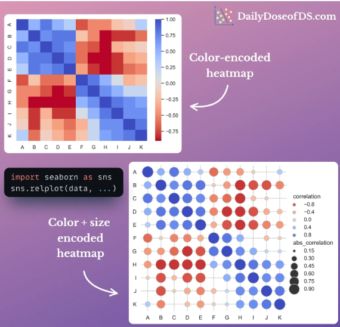
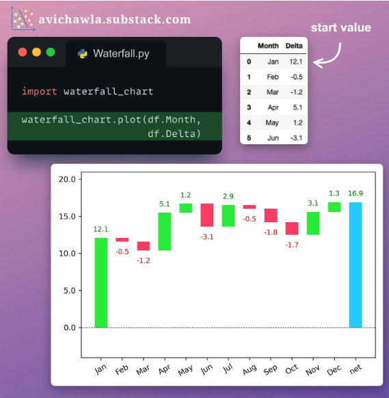
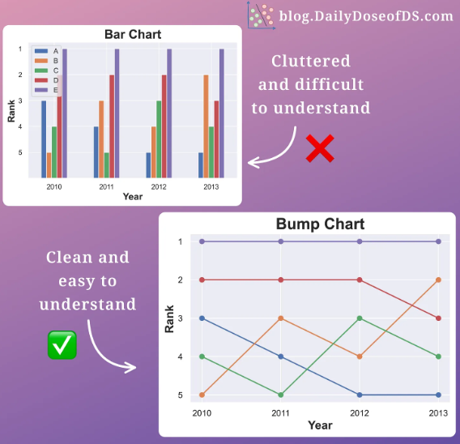
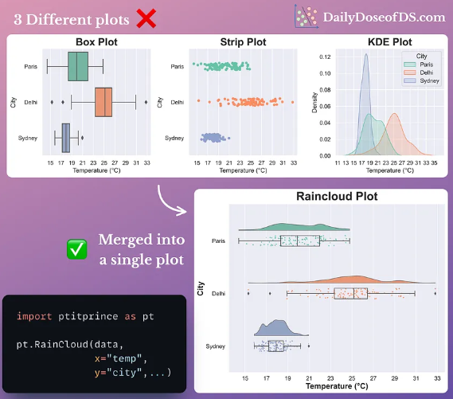
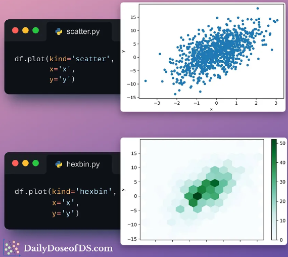
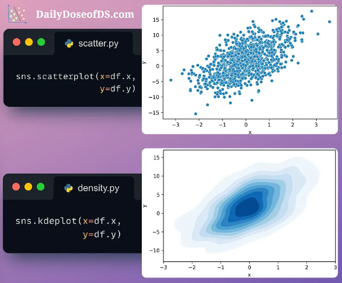
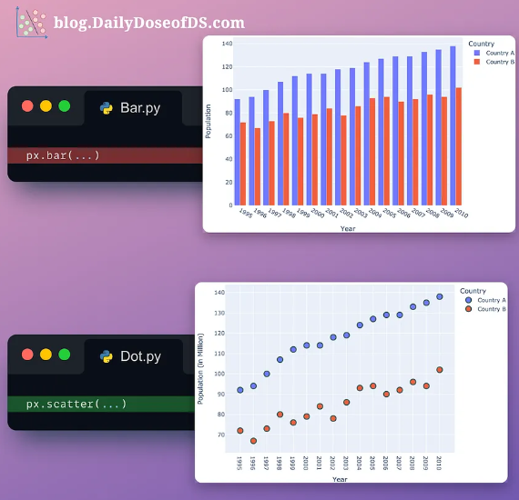

### <a id=python>PYTHON</a>

|Table of contents|
|:----------------|
|[Python](python.md)|
|[Visualization Techniques](python.md#vt)|
|[Backslash Character](#python.md#backslash)|

### 1.0 Familiarity with Functions, Reserved Keywords & Symbols

Familiarize yourself with functions, reserved keywords, and symbols to enhance your understanding of any programming code. In class, there is often a chapter-by-chapter syllabus, but different people have different learning methods.

For me, learning chapter by chapter sometimes makes me feel stuck, especially during programming tests. But, learning the common functions, keywords and symbols, does escalate my learning process.

Here are some common functions, keywords, and symbols:

#### Functions:
1. `print()`: Outputs a message to the console.
2. `input()`: Takes user input from the console.
3. `len()`: Returns the length of an object (e.g., string, list).
4. `range()`: Generates a sequence of numbers.
5. `type()`: Returns the type of an object.
6. `int()`: Converts a value to an integer.
7. `float()`: Converts a value to a floating-point number.
8. `str()`: Converts a value to a string.
9. `list()`: Creates a list.
10. `tuple()`: Creates a tuple.
11. `dict()`: Creates a dictionary.
12. `set()`: Creates a set.
13. `abs()`: Returns the absolute value of a number.
14. `sum()`: Returns the sum of elements in an iterable.
15. `max()`: Returns the maximum value in an iterable.
16. `min()`: Returns the minimum value in an iterable.
17. `sorted()`: Returns a sorted list of the specified iterable object.
18. `enumerate()`: Returns an enumerate object.
19. `zip()`: Returns an iterator that aggregates elements from multiple iterables.
20. `map()`: Applies a function to all items in an input list.

#### Reserved Keywords:
1. `False`: Represents the false value of the Boolean type.
2. `None`: Represents the absence of a value.
3. `True`: Represents the true value of the Boolean type.
4. `and`: A logical operator for boolean AND.
5. `as`: Used to create an alias while importing a module.
6. `assert`: Used for debugging purposes, tests if a condition is true.
7. `break`: Terminates the nearest enclosing loop.
8. `class`: Used to define a new class.
9. `continue`: Skips the rest of the code inside a loop for the current iteration only.
10. `def`: Used to define a new function.
11. `del`: Deletes objects.
12. `elif`: Used in conditional statements, same as else if.
13. `else`: Used in conditional statements.
14. `except`: Used with exceptions, what to do when an exception occurs.
15. `finally`: Used with exceptions, a block of code that will be executed no matter if there is an exception or not.
16. `for`: Used to create a for loop.
17. `from`: Used to import specific parts of a module.
18. `global`: Declares a global variable.
19. `if`: Used to make a conditional statement.
20. `import`: Used to import a module.
21. `in`: Used to check if a value is present in a list, tuple, etc.
22. `is`: Used to test if two variables refer to the same object.
23. `lambda`: Used to create an anonymous function.
24. `nonlocal`: Declares a non-local variable.
25. `not`: A logical operator for boolean NOT.
26. `or`: A logical operator for boolean OR.
27. `pass`: A null statement, a statement that will do nothing.
28. `raise`: Raises an exception.
29. `return`: Exits a function and returns a value.
30. `try`: Used to make a try...except statement.
31. `while`: Used to create a while loop.
32. `with`: Used to simplify exception handling.
33. `yield`: Ends a function and returns a generator.

#### Symbols:
1. `+`: Addition operator.
2. `-`: Subtraction operator/negation operator.
3. `*`: Multiplication operator.
4. `/`: Division operator.
5. `%`: Modulus operator.
6. `**`: Exponentiation operator.
7. `//`: Floor division operator.
8. `=`: Assignment operator.
9. `==`: Equality comparison operator.
10. `!=`: Not equal comparison operator.
11. `<`: Less than comparison operator.
12. `>`: Greater than comparison operator.
13. `<=`: Less than or equal to comparison operator.
14. `>=`: Greater than or equal to comparison operator.
15. `+=`: Increment assignment operator.
16. `-=`: Decrement assignment operator.
17. `*=`: Multiplication assignment operator.
18. `/=`: Division assignment operator.
19. `//=`: Floor division assignment operator.
20. `%=`: Modulus assignment operator.
21. `**=`: Exponentiation assignment operator.
22. `&`: Bitwise AND operator.
23. `|`: Bitwise OR operator.
24. `^`: Bitwise XOR operator.
25. `~`: Bitwise NOT operator.
26. `<<`: Bitwise left shift operator.
27. `>>`: Bitwise right shift operator.
28. `and`: Logical AND operator.
29. `or`: Logical OR operator.
30. `not`: Logical NOT operator.
31. `is`: Identity operator.
32. `in`: Membership operator.
33. `not in`: Negated membership operator.
34. `:`: Colon used in defining blocks and dictionaries.
35. `,`: Comma used to separate items in lists, tuples, and function arguments.
36. `.`: Dot used to access methods and attributes of objects.
37. `()`: Parentheses used in function calls and to define tuples.
38. `[]`: Square brackets used to define lists and to index/slice sequences.
39. `{}`: Curly braces used to define dictionaries and sets.
40. `#`: Hash symbol used to indicate comments.
41. `"""`: Triple quotes used for multi-line strings.

This list covers a broad range of functions, reserved keywords, and symbols that you'll encounter while programming in Python. There you go, happy learning, for practices you can visit any AI website for more on the definition, and test it at [one compiler](https://onecompiler.com/python) website to test the code.

## <a id="vt"></a> 8 Elegant Alternatives to Traditionals Plots

**1 Size-encoded heatmaps**

Color in heatmaps shows trends, but size clarifies exact values. Bigger size means bigger value (positive or negative).

<p align="center"></p>

**2 Waterfall Charts**

Line/bar charts hide small changes. Waterfall charts show how values rise and fall perfectly for visualizing small, incremental changes.

<p align="center"></p>

**3 Bump Chart**

Bar charts overwhelm with many ranks. Bump charts shine for visualizing category ranking changes over time.

<p align="center"></p>

**4 Raincloud Plots**

Box plots & histograms can be misleading. Raincloud plots combine 3 views (stats, overview, distribution) for clarity.

<p align="center"></p>

**5 Hexbin Plots**

Many data points? Ditch scatter plots for hexbins! These colorful hexagons show data density, making trends clearer.

<p align="center"></p>

**6 Density Plots**

Another choice is a density plot, which illustrates the distribution of points in a two-dimensional space.

<p align="center"></p>

**7 Bubble Charts**

Bar charts? Overwhelmed with categories?  Try bubble plots!  Imagine scatter plots with categories on one axis and size showing a separate value.

<p align="center"></p>

**8 Dot Plots**

Alternatively, dot plots work better for visualizing change over time.

<p align="center"></p>


### <a id=backslash>Backslash Character</a>

If we try to put a single quote character inside a single-quoted string, python gets confused:

```python
'Pluto's a planet!'
```
result: invalid syntax

we can fix this by "escaping" the single quote with a backslash.

```python
'Pluto\'s a planet!'
```
result: "Pluto's a planet!"

The table below summarizes some important uses of the backslash character.

|What you type..|What you get|example|print(example)|
|:-------------:|:----------:|:-----:|:------------:|
|\'|'|'What\'s up?'|What's up?|
|\"|"|"That's \"cool\""|That's "cool"|
|\\|\|"Look, a mountain: /\\"|Look, a mountain: /\|
|\n| | "1\n2 3"| 1
2 3|

the last sequence, `\n` represents the *newline character*. It causes Python to start a new line.


